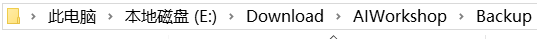
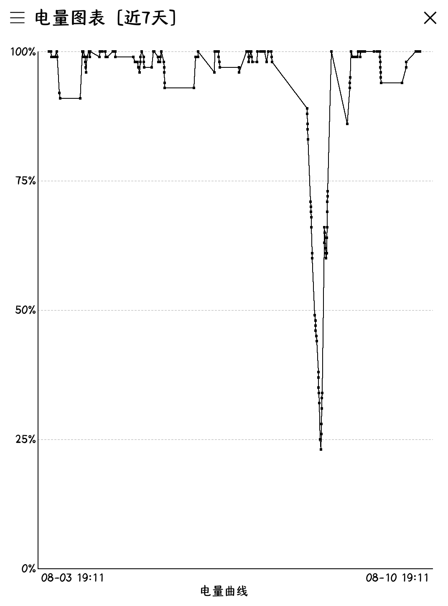
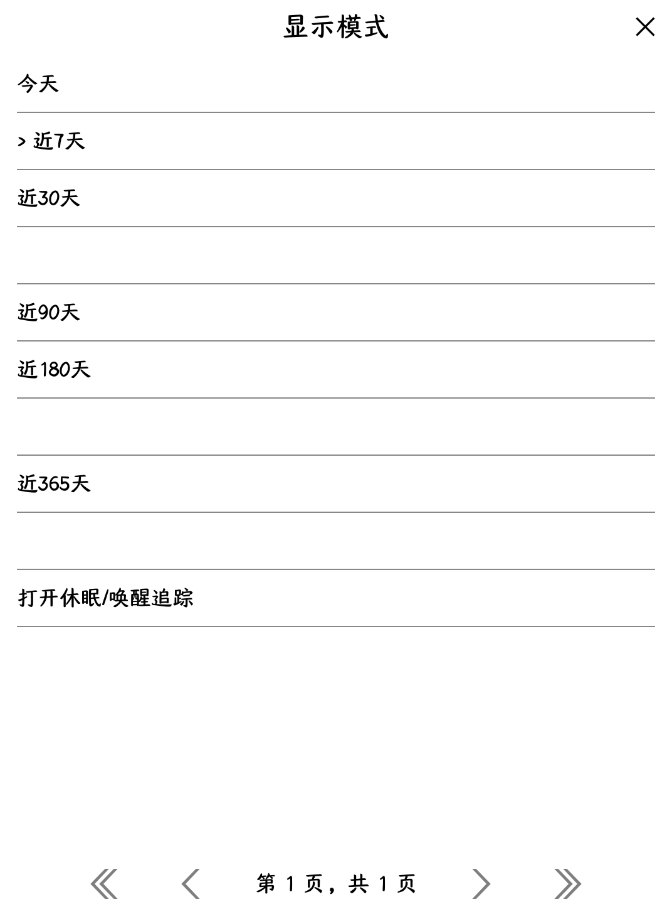
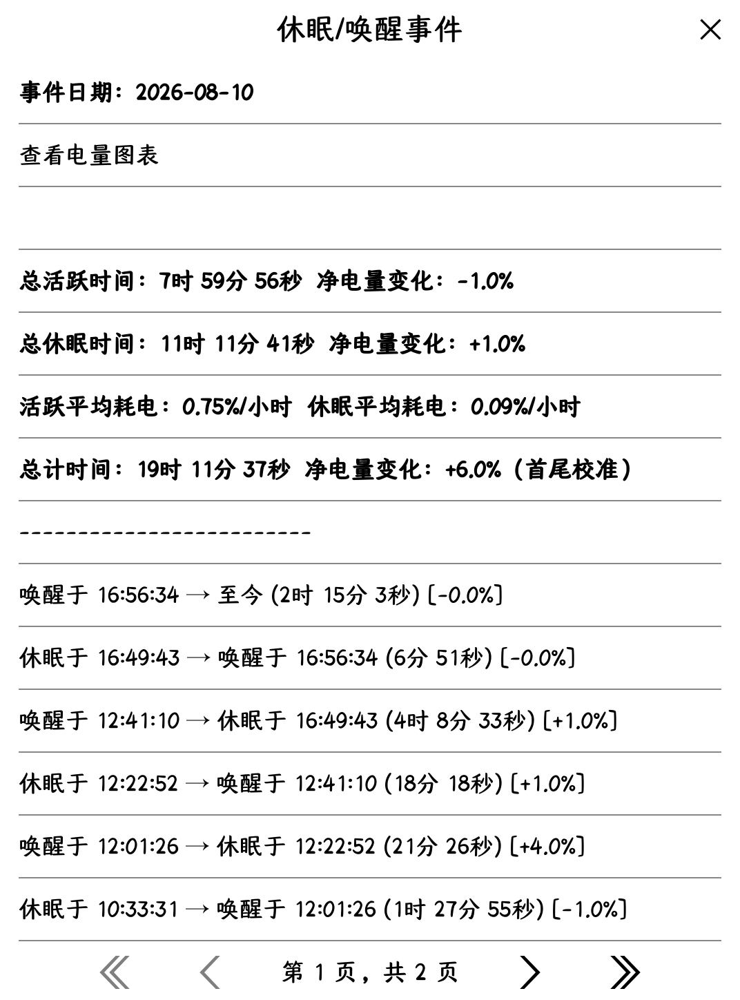

# 电量监测（BatteryMonitor）

KOReader 插件，把"电量曲线"与"休眠/唤醒追踪"合二为一，给墨水屏用户一份长期、连续、可读的电耗与作息画像。



> 标题图：插件入口（主菜单 → 更多工具 → 电量监测 → 三项子菜单）。本插件面向 Kindle PaperWhite 3（KPW3）等墨水屏设备，**全程灰度、无 emoji / 无 cfont 缺字形字符**，不会在墨水屏上变豆腐块。

---

## 功能

### 一、电量曲线



> *截图待补充：电量折线图主视图（x 轴 = 当前时间窗,y 轴 0–100%,黑实线 + 数据点），本 GitHub 仓库目前缺此图——以 `电量图表.png` 名预留位置。*

- **连续电量采样**：每 5 分钟读取一次设备电量与充电状态，按"1% 变化"或"1 小时至少 1 点"规则落盘，曲线不会因长时间满电而断开。
- **6 种时间窗视图**（默认"近 30 天"）：
  - 今天（`00:00` 起到当前时刻）
  - 近 7 天 / 近 30 天 / 近 90 天 / 近 180 天 / 近 365 天
- **固定窗口渲染**：x 轴严格按 `[cutoff, now]` 定位，今天视图从本地零点起算；切换窗口时**整图重绘但无需重建容器**（避免墨水屏闪烁）。
- **状态可查**：点按图中任意数据点，立即弹出"时间 / 电量 / 充电中·放电中"详情；右侧顶栏菜单可跳转休眠/唤醒追踪。
- **数据自动滚动**：只保留最近 365 天采样点（启动时轻量清理，不影响正在记录的会话）。

### 视图时间窗



> *截图待补充：顶栏菜单弹出的 6 种时间窗选项（今天 / 近 7 天 / 近 30 天 / 近 90 天 / 近 180 天 / 近 365 天），当前选中项以 ASCII `>` 标记（本插件不用 `✓` 避免 KPW3 cfont 缺字形），本仓库目前缺此图——以 `图表可选时间段.png` 名预留位置。*

### 二、休眠·唤醒追踪



> *截图待补充：当日 6 维统计 + 唤醒/休眠周期详情列表（倒序）。本仓库目前缺此图——以 `休眠及唤醒电量变化追踪.png` 名预留位置。*

- **自动事件记录**：每次设备休眠（`SLEEP`）与唤醒（`WAKE`）都会自动写入唯一日志文件 `all_events.log`；电量不可读时只记时间戳（占位值 `-1`，不污染统计）。
- **6 维当日统计**：
  1. 总活跃时间（h:m:s）
  2. 总休眠时间
  3. 活跃净电量变化 / 休眠净电量变化（**分段带符号累加，与全天首尾校准值对齐**）
  4. 活跃平均耗电 `%`/小时、休眠平均耗电 `%`/小时（仅统计真实放电，不被充电抵消）
  5. 总计净电量变化（全天首尾校准）
  6. 平均耗电率 `%`/小时 + 按当前电量的续航估算
- **异常短休眠自动标记**：单段低于 60 秒的休眠在周期详情里附 `[异常]` 标签，方便排查误触。
- **跨天闭合**：午夜或次日首条事件会单独标注"跨日活跃 / 跨日休眠"，统计不串日。
- **历史浏览器**：年份 → 月份 → 日期 三级导航（默认列出"今日 / 昨日 + 当前年 + 历史年"）。
- **日志健壮**：
  - 单文件超过 1 MB 自动轮转，保留 3 份 `*.bak.{1,2,3}` 备份
  - 启动时清理 365 天前数据
  - 损坏行自动剔除并写回清理过的全量数据

### 三、数据管理（休眠·唤醒子菜单 → 数据管理）

- **导出 CSV**：全量事件导出到设备根目录的隐藏文件 `.sleepwaketracker_export.csv`。
  - 自动探测设备根：Kindle `/mnt/us`、Kobo `/mnt/onboard`、PocketBook `/mnt/ext1`、Android `/sdcard`。
  - CSV 头 `日期,时间,事件,电量`，每行一条 `WAKE` / `SLEEP`。
- **从 CSV 导入**：提供"覆盖 / 追加"两种模式，导入时自动跳过非法电量（`0` / 负值 / 超 100）。
- **清除今日 / 清除全部**：二次确认；清除后自动刷新内存中的"最后事件"状态，避免新事件被去重漏记。

---

## 特色

- **单一插件、单一菜单入口**：原"电量图表"和"休眠/唤醒追踪器"原本是两个独立插件、各自在主菜单和 Dispatcher 各注册一份；本插件统一归并到 **主菜单 → 更多工具 → 电量监测**，避免菜单重复。
- **消除跨插件 `dofile` 雷**：原"休眠/唤醒追踪器"用 `dofile(插件目录/graphwidget.lua)` 硬编码跨插件路径加载图表，在 zip 形态下会失效——本插件改为进程内 `self._monitor:onShowBatteryGraph()` 直接委派。
- **双实例合并（FileManager + Reader）**：KOReader 的文件管理器与阅读器各自实例化插件，内存 `history` 互相独立。本插件在"挂起 / 唤醒 / 充电切换 / 关闭文档"等边界事件时**重新读取磁盘历史**与本实例内存合并后落盘，**周期采样不再每 5 分钟全量重排**（减少 e-ink 写入耗电）。
- **墨水屏友好**：
  - 充放电统一黑色实线（灰线在 KPW3 太淡）、单一图例"电量曲线"
  - 无 emoji、菜单勾选用 `>`、分隔项不画 Unicode 横线（避免 cfont 缺字形）
  - 切换视图模式**不重建窗口**（`setDirty("full")` 而非 `UIManager:close + show`）——避免墨水屏全屏闪烁
  - 电量采样规则"1% 变化或 1 小时至少 1 点"，曲线对长时间不变化的满电状态也不会"采样噪声"
- **续航估算**：基于全天耗电率推算按当前电量还能用多久（仅在纯放电时显示；边充边用会显示 `--`）。
- **跨日合一**：当次开机跨过零点也会自动归到"昨天"，统计更符合直觉。

---

## 安装

### 方式 A：直接拷贝（推荐）

1. 把整个 `batterymonitor.koplugin/` 目录**原样**拷贝到 KOReader 的插件目录：
   - Kindle：`koreader/plugins/`
   - Kobo：`/.adds/koreader/plugins/`
   - PocketBook：`koreader/plugins/`
   - Android：`/sdcard/koreader/plugins/`
2. 重启 KOReader。

### 方式 B：zip 打包

把 `batterymonitor.koplugin/` 整个目录打包成 zip（**保持内部目录结构**，不要让 `main.lua` 直接裸露在 zip 根），改名为 `batterymonitor.koplugin` 后放入上述任意插件目录，重启 KOReader。
（KOReader 原生支持目录与 zip 两种形式，本插件**两种均兼容**。）

### 升级 / 卸载

- 升级：覆盖同名目录即可，**已有数据文件保留**——电量采样数据与休眠/唤醒日志不会被覆盖清除。
- 卸载：删除 `batterymonitor.koplugin/` 目录；`settings/battery_graph.lua`、`sleepwaketracker/all_events.log` 保留或手动删除皆可。

---

## 使用

### 入口

主菜单（顶部下拉 / 底部工具栏的扳手图标）→ **更多工具** → **电量监测**。

子菜单三项：

1. **电量曲线** —— 打开电量折线图
2. **休眠/唤醒记录** —— 今日 / 昨日 / 浏览历史 / 数据管理 / 关于
3. **关于** —— 显示本插件说明

### 电量曲线使用步骤

1. 选中主菜单 → 更多工具 → 电量监测 → **电量曲线**，打开折线图。
2. 视图默认 **近 30 天**。
3. 点击顶栏左侧"菜单"图标（`appbar.menu`）弹出显示模式菜单，含 6 种时间窗以及"打开休眠/唤醒追踪"。
4. 直接 **点按折线上的数据点**：弹出"时间 / 电量 / 充电中·放电中"详情卡（3 秒自动消失）。
5. 点击折线**空白区域**或在任意位置上 **滑动**：关闭折线图、回到主菜单。

### 休眠/唤醒追踪使用步骤

选中主菜单 → 更多工具 → 电量监测 → **休眠/唤醒记录**：

| 子项 | 操作 |
| --- | --- |
| **显示今日事件** | 直接打开当日汇总：6 维统计 + 所有唤醒/休眠周期详情（倒序） |
| **显示昨日事件** | 直接打开昨日汇总 |
| **浏览历史** | 三级导航 年份 → 月份 → 日期（含"今日 / 昨日"快捷） |
| **数据管理** | 展开 5 个二级项：导出 CSV / 从 CSV 导入（覆盖）/ 从 CSV 导入（追加）/ 清除今日日志 / 清除全部历史 |
| **关于** | 显示本子模块特性清单 |

#### 数据管理使用提示

- **导出 CSV** 后用 USB 把设备根目录下的 `.sleepwaketracker_export.csv` 拷到电脑备份。
- **导入 CSV**：
  - 覆盖模式：用 CSV 内容**替换**所有现有事件（适合换设备后整体恢复）。
  - 追加模式：按"类型 + 时间戳"作为唯一键**去重**追加（适合日常增量备份恢复）。
- CSV 文件不存在时菜单会弹出"未找到文件"提示；非法电量（0 / 负值 / > 100）会被静默拒绝，不写入。

---

## 数据存储

| 内容 | 路径 |
| --- | --- |
| 电量曲线历史 | `koreader/settings/battery_graph.lua` |
| 休眠/唤醒事件日志 | `koreader/<data_dir>/sleepwaketracker/all_events.log` |
| 日志轮转备份 | 同目录 `all_events.log.bak.{1,2,3}` |
| CSV 导出文件（隐藏） | 设备根目录下的 `.sleepwaketracker_export.csv` |

日志行格式（`|` 分隔）：

```
<WAKE|SLEEP>|<unix 时间戳>|<电量%>
```

例：`WAKE|1762800000|85.0`

> 电量为 `-1` 表示硬件后端在该时刻未就绪（不影响周期长度统计，仅在涉及电量变化时分段会跳过该事件）。

---

## 兼容性

| 维度 | 支持情况 |
| --- | --- |
| KOReader 主流版本（nightly / stable） | ✅ |
| Kindle PaperWhite 3 (KPW3) 等墨水屏 | ✅（已做 KPW3 字形规避、灰阶折线、零闪烁视图切换） |
| Kobo / PocketBook / Android | ✅ |
| 与"系统电池检测插件" | 不冲突，**独立**插件，可并存 |

未触发的隐患（已知、已写代码规避）：
- `getCapacityHW` 跨设备返回原始值（> 100）：本插件优先使用 `getCapacity`（0–100 百分比），仅当其不可用时回退。
- FileManager 与 Reader 双实例丢点：边界事件合并 + 周期采样不合并（详见上文"特色 → 双实例合并"）。

---

## 致谢

本插件由「电量图表」与「休眠/唤醒追踪器」合并而来，感谢两位原作者的开源贡献：

- **电量图表（BatteryGraph）** by **ura23**
  ↗ [https://github.com/ura23/batterygraph.koplugin](https://github.com/ura23/batterygraph.koplugin)
- **休眠/唤醒追踪器（sleepwaketracker）** by **right9code**
  ↗ [https://github.com/right9code/sleepwaketracker.koplugin](https://github.com/right9code/sleepwaketracker.koplugin)

合并、调整与维护 by **ksaMask**。

---

## 版本与变更日志

当前版本：`v1.0.6`

完整版本演进、每次修改的动机 / 具体改动 / 校验结果见：

`audit/batterymonitor_changelog.html`

---

## 许可

继承两位原作者的开源许可，合并版本由 ksaMask 维护。如需在自己的 fork 二次发布，请同时保留两处致谢链接与原作者署名。
